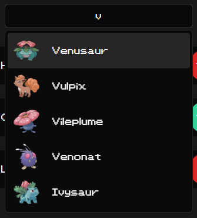
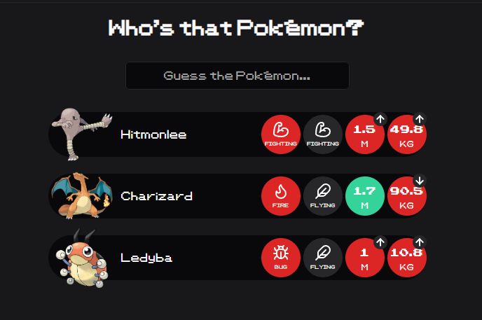

# Kémonpo

A game to guess which Pokémon was sorted. You can guess by type, height and weight.

This implementation is a custom game based on [Monképo](https://monkepo.online/).

## Rules

The current game has Pokémon up to the 3rd Generation (#386 - Deoxys).

Guess the Pokémon by typing in the input box and choosing from the options displayed.

Pokémon have 2 types at max. To see if the second type is correct, you must guess the first type beforehand.

### Features

- Gen 1 to 3 Guess Game

## Architecture

Vite + React + TS for the template.

[Shadcnui](https://ui.shadcn.com/) to make the UI components.

The API calls to the [GraphQL API](https://pokeapi.co/docs/graphql) were implemented with Apollo Client to fetch the data.

The API has a limit of 100 calls per day, therefore the response was saved in a `data.js` file in the project.

## Future Implementations

- Daily Guess
- Termoolike Guess
- Routing to other game modes
- Custom Guess (up to other generations and type selection)
